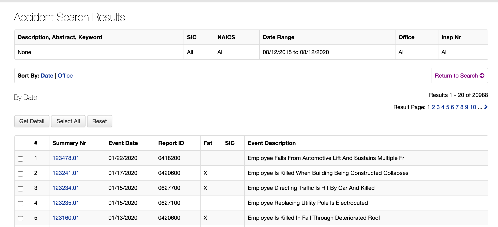

# Walkthrough of OSHA accident and inspection record sites

> **Note:** This guide assumes you're querying the SQLite database built at `data/wrangled/osha_wrangled.sqlite`

**Table of contents**

<!-- toc -->
<!-- tocstop -->

## OSHA interactive website URLs

OSHA has a couple of accident search endpoints:

Here's a standard search form:

[https://www.osha.gov/pls/imis/accidentsearch.html](https://www.osha.gov/pls/imis/accidentsearch.html)

Here's a listing of accidents in descending order of `Event Date`:

[https://www.osha.gov/pls/imis/AccidentSearch.search](https://www.osha.gov/pls/imis/AccidentSearch.search)

