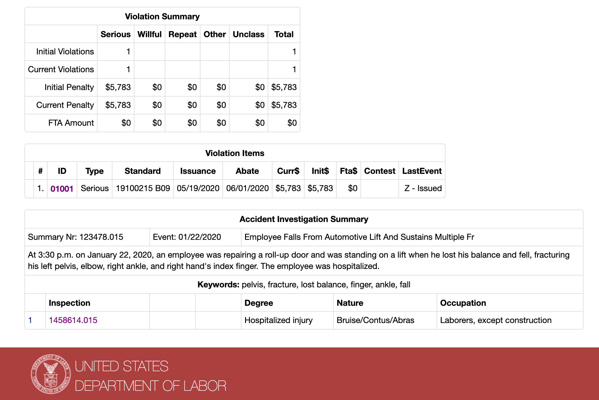

### How it looks on the OSHA website

#### The accident report detail page

The URL for the Accident Report Detail corresponds to the accident ID of [123478.015](https://www.osha.gov/pls/imis/accidentsearch.accident_detail?id=123478.015):

[https://www.osha.gov/pls/imis/accidentsearch.accident_detail?id=123478.015](https://www.osha.gov/pls/imis/accidentsearch.accident_detail?id=123478.015)

### The corresponding inspection report detail page

The accident detail page links to the resulting inspection, which has an ID of [1458614.015](https://www.osha.gov/pls/imis/establishment.inspection_detail?id=1458614.015) and a corresponding URL at the `establishment.inspection_detail` endpoint:

[https://www.osha.gov/pls/imis/establishment.inspection_detail?id=1458614.015](https://www.osha.gov/pls/imis/establishment.inspection_detail?id=1458614.015)

The top half of the Inspection Detail page shows inspection information, including details about the business/work site:

The bottom half shows the violation summary, including a table of **Violation Items** and an **Accident Investigation Summary**

