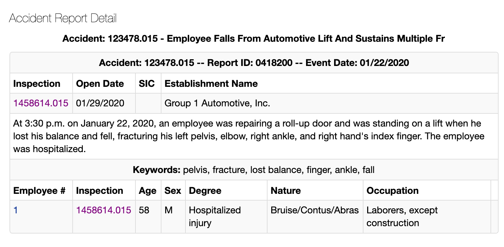
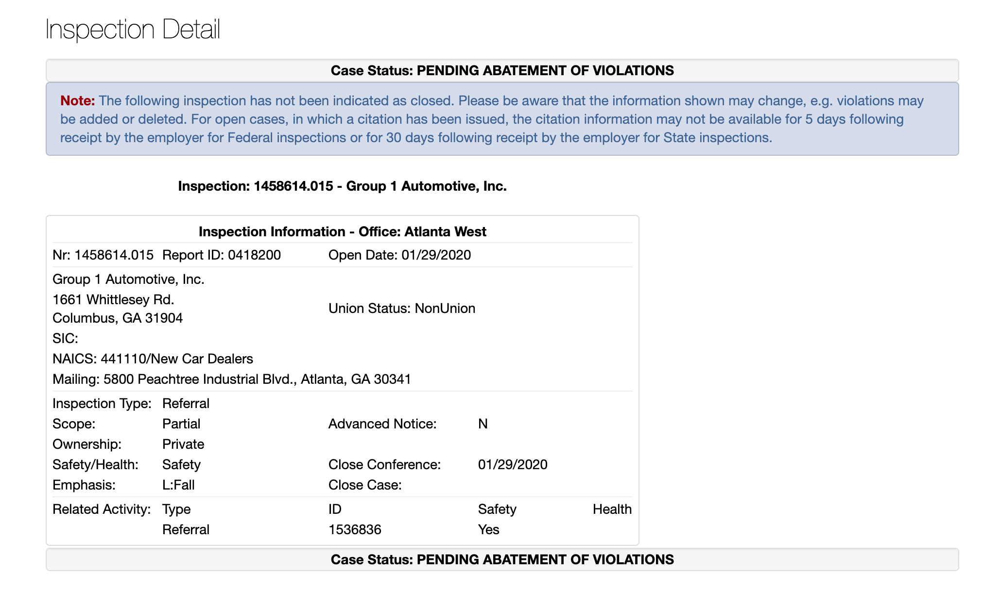
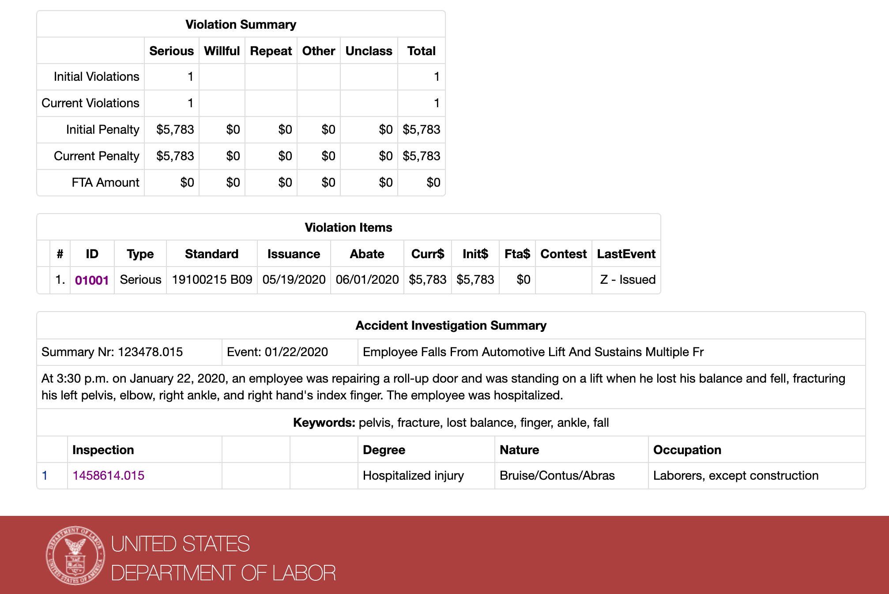

<!----compiled-by-writhub--- -->

<!-- [writhub-collation]: walkthroughs/single-accident-inspection/000-accident-inspection-overview.md  -->
# Walkthrough of OSHA accident and inspection record sites

> **Note:** This guide assumes you're querying the SQLite database built at `data/wrangled/osha_wrangled.sqlite`

**Table of contents**

<!-- toc -->

- [OSHA interactive website URLs](#osha-interactive-website-urls)
- [An accident that led to an injury (#123478.015)](#an-accident-that-led-to-an-injury-%23123478015)
  * [Case status and summary](#case-status-and-summary)
  * [How it looks on the OSHA website](#how-it-looks-on-the-osha-website)
    + [The accident report detail page](#the-accident-report-detail-page)
  * [The corresponding inspection report detail page](#the-corresponding-inspection-report-detail-page)
  * [The data attributes of Accident #123478.015](#the-data-attributes-of-accident-%23123478015)
    + [Accident data table](#accident-data-table)

<!-- tocstop -->

## OSHA interactive website URLs

OSHA has a couple of accident search endpoints:

Here's a standard search form:

[https://www.osha.gov/pls/imis/accidentsearch.html](https://www.osha.gov/pls/imis/accidentsearch.html)

Here's a listing of accidents in descending order of `Event Date`:

[https://www.osha.gov/pls/imis/AccidentSearch.search](https://www.osha.gov/pls/imis/AccidentSearch.search)

<!-- [/writhub-collation]: walkthroughs/single-accident-inspection/000-accident-inspection-overview.md  -->

<!-- [writhub-collation]: walkthroughs/single-accident-inspection/100-accident-injury-123478.015-overview.md  -->
## An accident that led to an injury (#123478.015)

On January 22, 2020, an employee at Group 1 Automotive, Inc. in Columbus, GA, fell from an automotive lift and was hospitalized for multiple injuries and fractures.

The HTML for the 3 endpoints is mirrored at [assets/files/pages/](assets/files/pages/)

### Case status and summary

This is a case where there is:

- 1 accident
- 1 inspection
- 1 violation

The exact description from the report's inspection/investigation summary:

> At 3:30 p.m. on January 22, 2020, an employee was repairing a roll-up door and was standing on a lift when he lost his balance and fell, fracturing his left pelvis, elbow, right ankle, and right hand's index finger. The employee was hospitalized.

As of 2020-08-12, the **case status** is: PENDING ABATEMENT OF VIOLATIONS

The [inspection detail page has this disclaimer](https://www.osha.gov/pls/imis/establishment.inspection_detail?id=1458614.015):

> Note: The following inspection has not been indicated as closed. Please be aware that the information shown may change, e.g. violations may be added or deleted. For open cases, in which a citation has been issued, the citation information may not be available for 5 days following receipt by the employer for Federal inspections or for 30 days following receipt by the employer for State inspections.

<!-- [/writhub-collation]: walkthroughs/single-accident-inspection/100-accident-injury-123478.015-overview.md  -->

<!-- [writhub-collation]: walkthroughs/single-accident-inspection/120-accident-injury-website.md  -->

### How it looks on the OSHA website

#### The accident report detail page

The URL for the Accident Report Detail corresponds to the accident ID of [123478.015](https://www.osha.gov/pls/imis/accidentsearch.accident_detail?id=123478.015):

[https://www.osha.gov/pls/imis/accidentsearch.accident_detail?id=123478.015](https://www.osha.gov/pls/imis/accidentsearch.accident_detail?id=123478.015)

### The corresponding inspection report detail page

The accident detail page links to the resulting inspection, which has an ID of [1458614.015](https://www.osha.gov/pls/imis/establishment.inspection_detail?id=1458614.015) and a corresponding URL at the `establishment.inspection_detail` endpoint:

[https://www.osha.gov/pls/imis/establishment.inspection_detail?id=1458614.015](https://www.osha.gov/pls/imis/establishment.inspection_detail?id=1458614.015)

The top half of the Inspection Detail page shows inspection information, including details about the business/work site:

The bottom half shows the violation summary, including a table of **Violation Items** and an **Accident Investigation Summary**

<!-- [/writhub-collation]: walkthroughs/single-accident-inspection/120-accident-injury-website.md  -->

<!-- [writhub-collation]: walkthroughs/single-accident-inspection/150-accident-injury-data-sql.md  -->
### The data attributes of Accident #123478.015

#### Accident data table

As derived from the [accident detail page](https://www.osha.gov/pls/imis/accidentsearch.accident_detail?id=123478.015)

| Attribute  |                        Value                        |
|------------|-----------------------------------------------------|
| summary_nr | 123478.015                                          |
| report_id  | 0418200                                             |
| event_date | 2020-01-22 15:30                                    |
| keywords   | pelvis, fracture, lost balance, finger, ankle, fall |
| event_desc | Employee Falls From Automotive Lift And Sustains... |
|            |                                                     |

<!-- [/writhub-collation]: walkthroughs/single-accident-inspection/150-accident-injury-data-sql.md  -->
